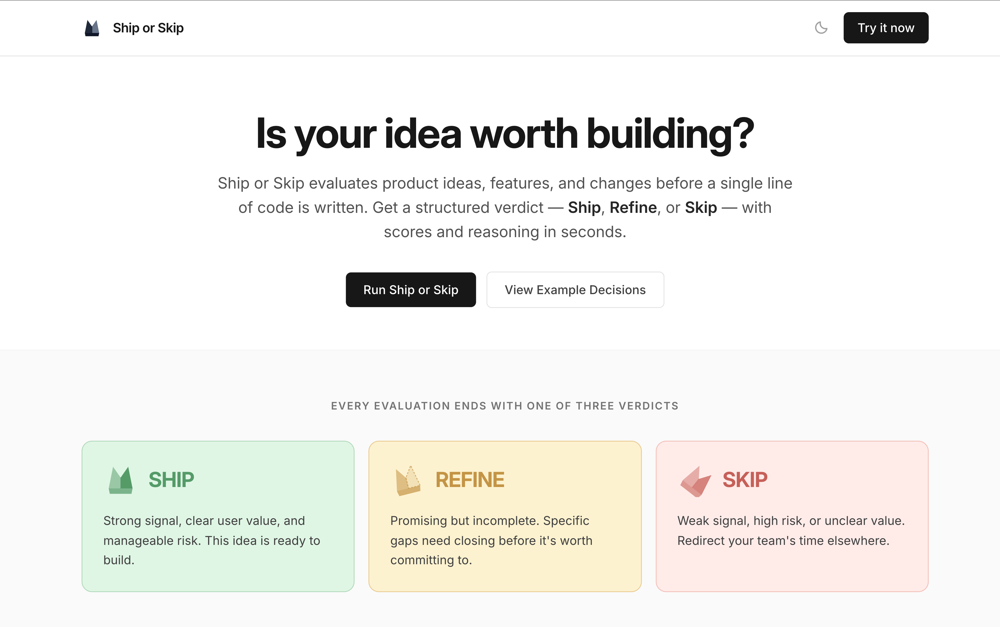
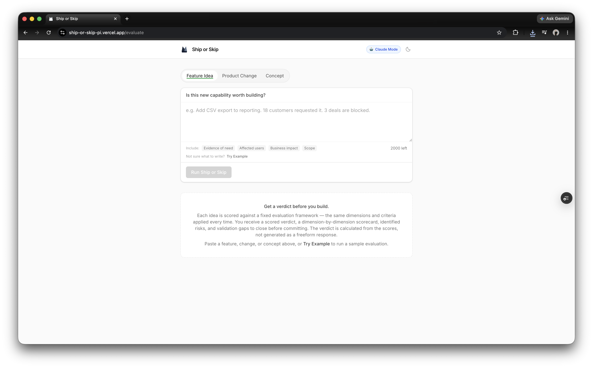
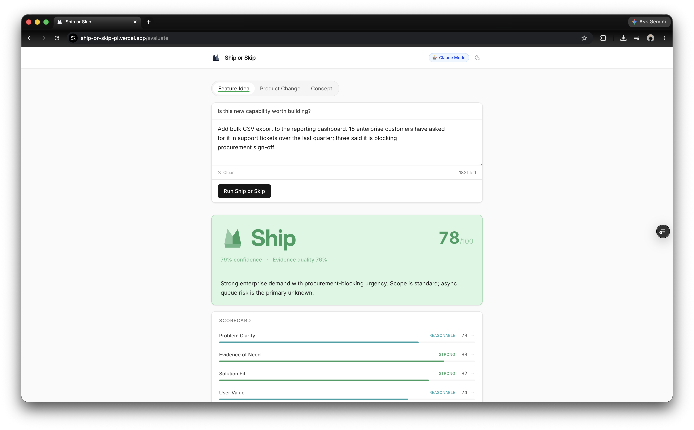
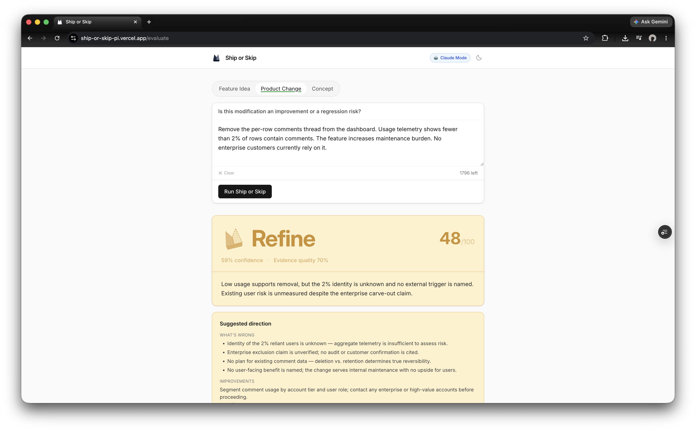
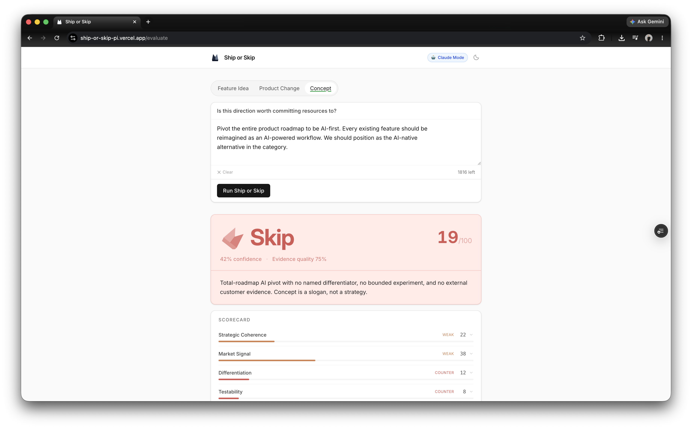

# Ship or Skip

A pre-build decision engine for product teams. Submit a feature idea, product change, or strategic concept — get a structured **Ship**, **Refine**, or **Skip** verdict in seconds.

---

## Live Demo

**[→ ship-or-skip-pi.vercel.app](https://ship-or-skip-pi.vercel.app/)**

No sign-up. No API key required. Click **Try Example** to explore all three verdict outcomes across all three evaluation modes.

> The public deployment uses deterministic evaluations for stable, zero-cost demo access. Live AI is fully implemented — see [Quick Start](#quick-start) to run with a live Anthropic key.

---

## Screenshots

| Landing                                         | Evaluator                                           |
| ----------------------------------------------- | --------------------------------------------------- |
|  |  |

| Ship                                         | Refine                                           | Skip                                         |
| -------------------------------------------- | ------------------------------------------------ | -------------------------------------------- |
|  |  |  |

---

## What Makes It Different

Most AI tools return free-form opinion. Ship or Skip applies a fixed evaluation framework: Claude scores seven named dimensions per evaluation mode, and the **verdict is computed server-side by a deterministic weighted formula**. The model cannot override the framework, skip an inconvenient dimension, or justify a weak idea with confident prose.

The same idea evaluated twice produces the same verdict. Every decision is traceable — from verdict, to dimension, to supporting signals.

---

## Features

| Feature                     | Description                                                                                                 |
| --------------------------- | ----------------------------------------------------------------------------------------------------------- |
| **Three verdicts**          | Ship, Refine, or Skip — computed from weighted dimension scores, not model opinion                          |
| **Three evaluation modes**  | Feature Idea, Product Change, Concept — each with a distinct 7-dimension rubric                             |
| **Risk identification**     | 2–5 named risks per evaluation, each linked to a rubric dimension and rated high / medium / low             |
| **Validation gap analysis** | Missing evidence surfaces as concrete questions with a `whyItMatters` explanation and a `howToCheck` action |
| **Refine recommendations**  | When a verdict is Refine: named weaknesses, targeted improvements, and a specific re-evaluation trigger     |
| **Copy to Markdown**        | One-click export of the full evaluation — verdict, scorecard, risks, and gaps                               |
| **Mock mode**               | Full UI with no API key; five pre-built results cover all three modes and all three verdict outcomes        |
| **In-memory result cache**  | Identical `(mode, idea)` pairs return cached results, avoiding duplicate API calls                          |
| **Dark mode**               | Persists to `localStorage`; respects `prefers-color-scheme` on first visit                                  |

---

## Quick Start

```bash
git clone https://github.com/joshuaearlsultan/ship-or-skip.git
cd ship-or-skip
npm install
```

**Mock mode — no API key needed:**

```bash
npm run dev
# Open http://localhost:5173
# Click Try Example for an instant result across all three modes
```

**Live Claude evaluations:**

```bash
cp .env.example .env.local
# Edit .env.local:
#   USE_MOCK_EVALUATIONS=false
#   USE_COMPANY_GATEWAY=false
#   ANTHROPIC_API_KEY=sk-ant-api03-...   ← console.anthropic.com
#   ANTHROPIC_MODEL=claude-sonnet-4-6
npm run dev
```

> Requires **Node.js ≥ 18** and an [Anthropic API key](https://console.anthropic.com).  
> Switch between Mock and Claude modes at any time using the badge in the top-right corner of the app.

---

## Configuration

Copy `.env.example` to `.env.local`. This file is gitignored and never committed.

| Variable               | Purpose                                        | Default                        |
| ---------------------- | ---------------------------------------------- | ------------------------------ |
| `USE_MOCK_EVALUATIONS` | Set to `"false"` to enable live AI calls       | `true` (mock active if absent) |
| `USE_COMPANY_GATEWAY`  | Route via company AI gateway instead of direct | `false`                        |
| `ANTHROPIC_API_KEY`    | Anthropic key (direct mode)                    | —                              |
| `ANTHROPIC_MODEL`      | Model identifier                               | `claude-sonnet-4-6`            |
| `COMPANY_GATEWAY_URL`  | Gateway endpoint URL (gateway mode)            | —                              |
| `COMPANY_GATEWAY_KEY`  | Gateway auth key (gateway mode)                | —                              |

`USE_MOCK_EVALUATIONS` must be the exact string `"false"` to enable live calls. Any other value — including absent — keeps mock mode active. The app never calls an AI provider by accident.

→ [Full configuration reference, Vercel deployment, and troubleshooting](./docs/configuration.md)

---

## How It Works

```
Browser → POST /api/evaluate { mode, idea }
              ↓
  1. Validate request       Zod — rejects malformed input early
  2. Assemble prompt        prompts/system.md + prompts/{feature|change|concept}.md
  3. Call Claude            Anthropic API
  4. Validate output        strict Zod schema — rejects malformed model responses
  5. Compute verdict        overallScore = Σ(score × weight)
                            Ship | Refine | Skip  (deterministic)
  6. Return DecisionResult → verdict card, scorecard, risks, validation gaps
```

The verdict is never chosen by the model. Claude scores dimensions; the server applies a weighted formula and emits the verdict deterministically.

→ [Full rubric specification, dimension weights, and verdict thresholds](./docs/evaluation-framework.md)

---

## Architecture

- **Single process in development** — frontend and `POST /api/evaluate` run on the same port via Vite SSR middleware; no separate backend to start
- **Serverless in production** — `api/evaluate.ts` deploys as a Vercel function with no code changes
- **Dual AI provider** — routes to Anthropic directly or via a company AI gateway; one env var switch, no code changes
- **Schema-enforced output** — model responses are validated against a strict Zod schema before any result is assembled; the UI never renders partial or structurally incorrect data

→ [Provider architecture, design decisions, and project structure](./docs/architecture.md)

---

## Tech Stack

**Frontend** — React 19 · TypeScript 6 · Tailwind CSS v4 · Vite 8  
**Backend** — Node.js serverless (Vercel) · Zod 4 schema validation  
**AI** — Anthropic Claude · model configurable via `ANTHROPIC_MODEL`

---

## Deployment

```bash
npm run build
npx vercel --prod
```

Set `USE_COMPANY_GATEWAY=false`, `ANTHROPIC_API_KEY`, `ANTHROPIC_MODEL=claude-sonnet-4-6`, and `USE_MOCK_EVALUATIONS=false` in Vercel → Project → Settings → Environment Variables.

→ [Full deployment guide](./docs/configuration.md#vercel-deployment)

---

## Documentation

| Document                                               | Contents                                                                 |
| ------------------------------------------------------ | ------------------------------------------------------------------------ |
| [Evaluation Framework](./docs/evaluation-framework.md) | Rubric specification, dimension weights, verdict formulas, scoring logic |
| [Configuration](./docs/configuration.md)               | Environment variables, Vercel deployment, troubleshooting                |
| [Architecture](./docs/architecture.md)                 | Provider abstraction, pipeline design, project structure                 |
| [API Contract](./docs/api-contract.md)                 | `POST /api/evaluate` request and response schemas                        |
